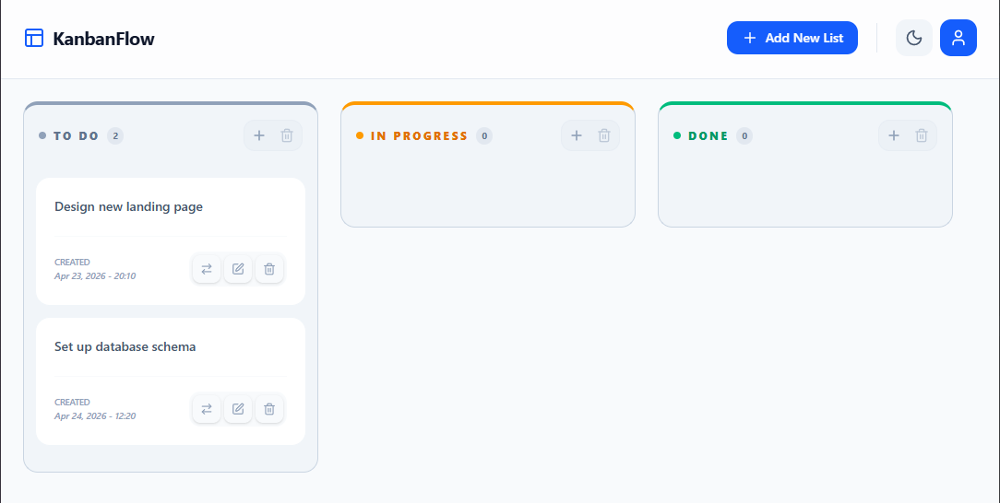

# KanbanFlow | project management tool

https://story-gardenx.netlify.app/

A modern, responsive Kanban board focusing on fluid UX and robust state management. Built with `React Context API` and `Tailwind 4`, featuring smart portals, dynamic status coding, and a single-action focus architecture.

## Technical Highlights:

- **Global State Orchestration:** Centralized action management via `Context API` to ensure only one interaction (edit/delete/move) is active at a time.

- **Smart Floating Menus:** Custom-built dropdowns using fixed positioning and `getBoundingClientRect()` to bypass parent container clipping.

- **Event Conflict Resolution:** Utilized `onMouseDown` patterns to eliminate the "Blur vs. Click" race condition for seamless user interactions.

- **Tailwind 4 & Modern UI:** Leveraged `Tailwind v4's` latest syntax for fluid layouts, dynamic status-based color coding, and dark mode.

- **Optimized Scroll Management:** Implemented patterns to keep column headers fixed while task lists remain scrollable.

- **Hybrid Action Groups:** Balanced UI design featuring `Action Capsules` that house primary and secondary triggers without breaking layout symmetry.

## Built With:

- React, React Context API, Tailwind CSS 4, Lucide React
